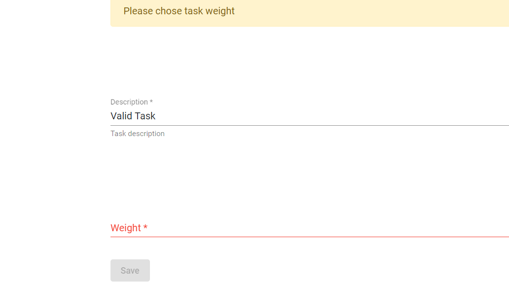

## Table of contents
* [General info](#general-info)
* [Screenshots](#screenshots)
* [Technologies](#technologies)
* [Setup](#setup)
* [Features](#features)
* [Status](#status)
* [Inspiration](#inspiration)
* [Contact](#contact)

## General info
The main goal of this project was to make first full stack application using MySQL as a database, SpringBoot REST and Angular. It allows CRUD operations for a user. 

## Screenshots
	
		

## Technologies
* MySQL - 8.0
* SpringBoot - 2.1.5
* Angular CLI - 7.3.9

## Setup
Describe how to install / setup your local environement / add link to demo version.

## Code Examples
Code for updating existing Todo item. 
    
`@PutMapping("/todos/{id}") ` 
`public Todos updateTodo(@PathVariable int id, @RequestBody Todos todo) throws ResourceNotFoundException {`  `todo.setId(todo.getId());  ` 
`todo.setTaskDescritpion(todo.getTaskDescritpion());`  
 `todo.setTaskWeight(todo.getTaskWeight()); ` 
` todo.setTaskDate(todo.getTaskDate());`  
`final Todos updatedTodo = iTodosRepository.save(todo);`  
 `return updatedTodo; ` 
`  }`

Angular update Todo:
  
`updateSingleTodo(id, todo) {  
  return this.http.put<Todo>(`http://localhost:8081/todos/${id}`, todo);  
}`

add-single-todo-form.component.ts

`addOrUpdateSingleTodo() {  `
`  if (this.id === -1) {  `
    `this.addSingleTaskService.createNewTodoTask(this.todo).subscribe(  `
    `  data => {  `
        `console.log('adding new task data ' + data);  `
`  this.router.navigate(['todos']); ` 
`  }  `
 `   );  `
`  } else {  `
  `  this.addSingleTaskService.updateSingleTodo(this.id, this.todo).subscribe(  `
   `   data => {  `
   `    console.log('updating task data ' + data);  `
`  this.router.navigate(['todos']);  `
`  }  `
  `  );  `
`  }  `
`}`

Angular Validation:
add-single-todo-form.component.html

`<form (ngSubmit)="addOrUpdateSingleTodo() && !validationForSingleTodo.invalid" #validationForSingleTodo="ngForm">  `
  
` 
 <mat-form-field appearance="legacy">  `
` <mat-label>Description</mat-label>  `
 `<input matInput placeholder="Description" ` 
 ` [(ngModel)]="todo.taskDescritpion" `
  `name="description" ` 
 ` #descriptionValidation="ngModel"  `
`  minlength="5" ` 
 `required="required"  `
`  >  `
 `<mat-hint>Task description</mat-hint>  `
` </mat-form-field> 
`

## Features
List of features ready and TODOs for future development
* User can perform basic CRUD operation on single todo item. Information are being stored in database.
* 
* It would be nice to add new user table into database and allows single user to log in and own user will have unique todos. 
* Add JWT token authentication
* Use BCrypt to store user passwords in database

## Status
Project is: At this moment project is finished. The main goal was achieved. 

## Inspiration
The main inspiration was desire to learn how to implements SpringBoot REST + Angular application.

## Contact
Created by [@orestwojtowicz](https://orestwojtowicz.github.io/) - feel free to contact me!
